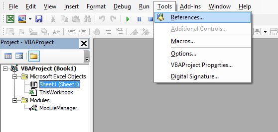
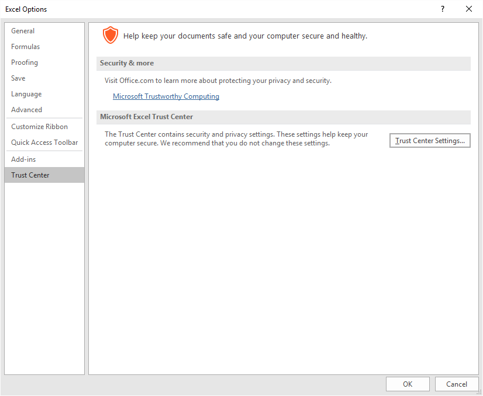
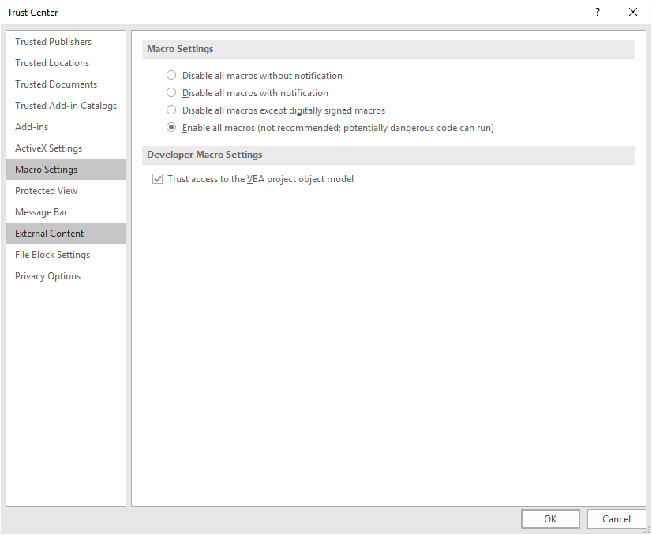

# Why Use Module Manager?

The Module Manager makes it much easier to work with complex VBA projects by handling the automatic importing and exporting of Excel VBA Modules, Class Modules, and UserForms.  The Module Manager imports modules (\*.bas, \*.frm, \*.frx, and \*.cls files) from specified directories when the workbook is opened, re-exports them to specified directories when the workbook is saved, and removes them when the workbook is closed. This provides the following benefits:
* Code is stored as text, allowing macros to be edited in the IDE of your choice, like Visual Studio or Notepad++. All changes will be imported to the VB Editor (VBE) the next time you open the workbook!
* Storing code as text (rather than inside a binary workbook file) also facilitates change tracking with version control software like Git or SVN.
* Storing code in files separate from the main workbook eases collaboration on multiple macros within the same workbook, and allows for more atomic commits.
* By removing modules when the workbook is closed, the Module Manager prevents duplication of code between the text files and the workbook itself, and reduces the size of the workbook while it is sitting around on your hard drive. This is especially powerful in combination with Git [Large File Storage (LFS)](https://git-lfs.github.com/).

## Setup
ModuleManager works with Excel 2007 and later (not tested in 2003 or earlier). These instructions apply specifically to Excel (and I've only tested the Module Manager on Excel), but ModuleManger should work with all Microsoft Office VB Editors. The following screenshots show the setup for Excel 2016 on a Windows 10 machine.

1. __Import the ModuleManager module__ file into your workbook(s). You can either copy-paste the [ModuleManager.bas](ModuleManager.bas) source code into a new Module within the VB Editor (VBE), or clone/download this repo and import the ModuleManager.bas file directly. Within the VBE, in the Project Explorer view, right click anywhere under the name of your workbook and select "Import file...".  Select the ModuleManager.bas file that you just downloaded and click "Open".

**Note, module management does not apply to the ModuleManager itself, so it will always be present in the workbook and will never be re-imported, exported, or removed.**


2. __Add necessary references.__  Within the VBE, select "Tools > References".  In the dialog box, make sure that the following references are selected.  If any other references are already selected, then you should probably leave those too!
 * Visual Basic For Applications
 * Microsoft Excel x.x Object Library
 * OLE Automation
 * Microsoft Office x.x Object Library
 * Microsoft Scripting Runtime
 * Microsoft Visual Basic for Applications Extensibility x.x  

  


3. __Enable developer macro settings.__  In Excel, click "File > Options > Trust Center > Trust Center Settings...".  In the dialog box, select "Macro Settings", then check "Enable all macros" (or "Disable all macros except digitally signed macros" if you know what you're doing), __and__ "Trust access to the VBA project object model".  

  



4. __Paste the following code__ into the "ThisWorkbook" module of your workbook (visible in the Project Explorer).  This is the code that actually handles the Workbook Open, Save, and Close events.  Without it, ModuleManager would just take up space!  The comments provide further instructions on customization of the ModuleManager.

**Make sure you remove or comment out these statements when you are ready to provide this workbook to end users.** Otherwise, they might get confused by message boxes about import/export errors and strange text files appearing in the same folder as the workbook. Macros should always be present in the workbook for your end users, as they should not be viewing/editing the macros anyway.

```vbnet
Private Sub Workbook_Open()
    'Provide the path to a directory with VBA code files. Paths may be relative or absolute.
    'You can add additional ImportModules() statements to import from multiple locations.
    'The boolean argument specifies whether or not to show a Message Box on completion.
    'Remove or comment out these statements when you are ready to provide this workbook to end users,
    'so that they don't get confused by message boxes about import errors.
    Call ImportModules(ThisWorkbook.Name & ".modules", ShowMsgBox:=True)
End Sub

Private Sub Workbook_BeforeSave(ByVal SaveAsUI As Boolean, ByRef Cancel As Boolean)
    'Provide the path to a directory where you want to export modules. Paths may be relative or absolute.
    'You can add additional ExportModules() statements to export to multiple locations.
    'Remove or comment out these statements when you are ready to provide this workbook to end users,
    'so that they don't get confused by the appearance of a bunch of mysterious code files upon saving!
    Call ExportModules(ThisWorkbook.Name & ".modules")
End Sub

Private Sub Workbook_BeforeClose(ByRef Cancel As Boolean)
    'The boolean argument specifies whether or not to show a Message Box on completion.
    'Remove or comment out this statement when you are ready to provide this workbook to end users,
    'so that modules are not removed, and functionality is not broken the next time the workbook is opened.
    Call RemoveModules(ShowMsgBox:=True)
End Sub
```

## Support
Issues and support questions may be posted on this repository's [Issues page](https://github.com/DanwareCreations/VbaModuleManager/issues).

## License
[MIT](./LICENSE.txt)
